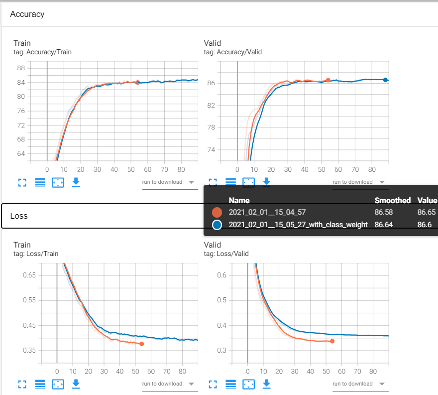
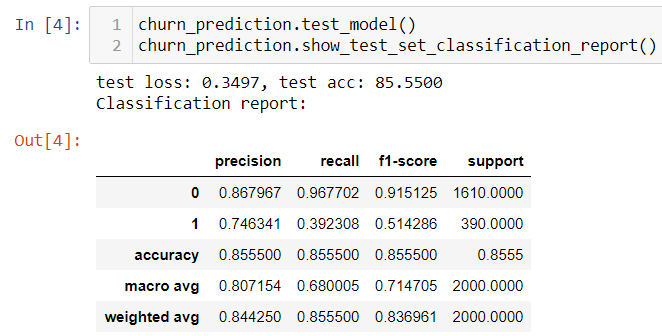
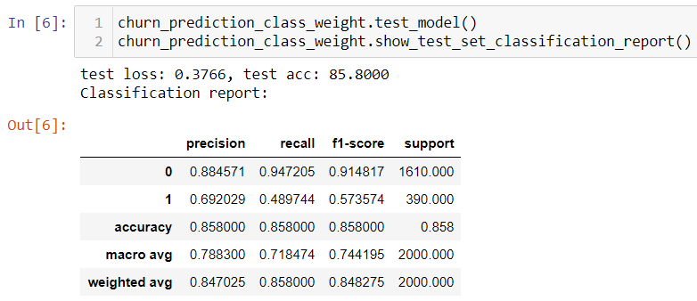
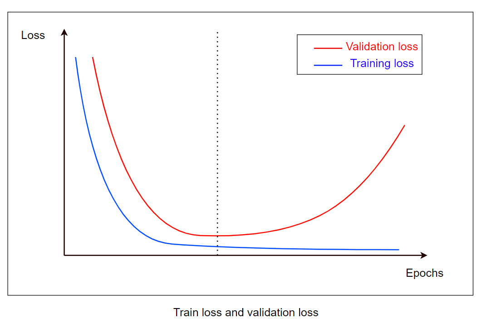

## Churn customer prediction
Using embedding combine the categorical data and numerical data to predict whether the customer is Exited  
It can be use to find the churn customer and try to keep them in the future  

## Performance
***Training and Validation loss***
   

***Without class weight***  
The precision and recall of class 1 is lower thand class 0
   

***With class weight***  
As the number of class 1 data is less than class 0, i assign a class weight [0.8, 1]  
The f1-score of class 1 is little bit improved
   

## Technical term description
***Embeddings***  
--> reduce the dimensionality of categorical variables and meaningfully represent categories in the transformed space  

***Batch normalization***  
--> reduce training time and make tranable  (less Covariate Shift and less vanishing gradients)

***Dropout***  
(ignoring units (i.e. neurons) during the training phase of certain set of neurons which is chosen at random)  
--> avoid curbs the individual power of each neuron (prevent over-fitting)  

***Early stopping***  
if not stop early, the model will overfit and generate a larger loss
   

***TensorBoard***  
is a tool for providing the (INSTANT) measurements and visualizations needed during the machine learning workflow  

***Classification report***  
Precision: tp / actual result = tp / (tp + fp)    
Recall: tp / predicted result = tp/(tp + fn)   
F1 = 2 * (precision * recall) / (precision + recall)  
support is the number of samples of the true response  

## Guideline of TensorBoard
type command: tensorboard --logdir=C:/Users/Auyin/PycharmProjects/churn-prediction/train_valid_log/

## Dataset
https://www.kaggle.com/c/churn-modelling

